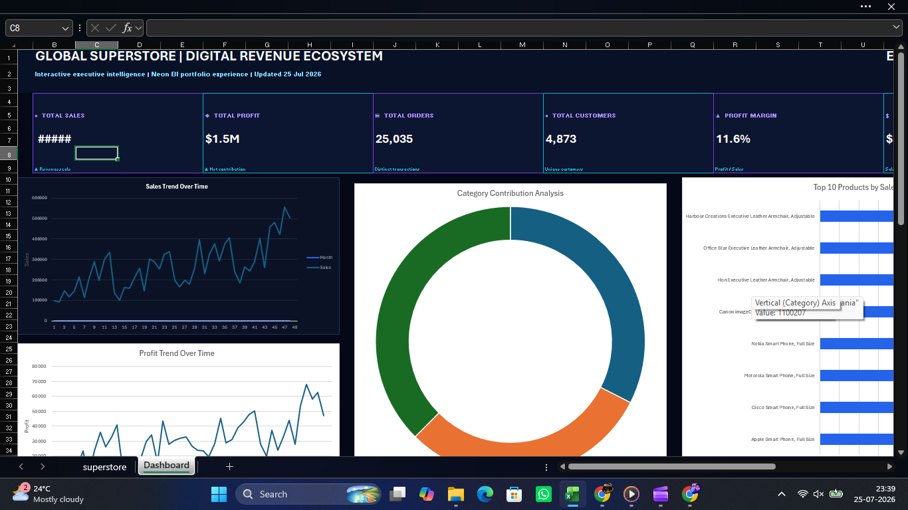

# 📊 AI-Powered Sales Analytics Dashboard

## 📌 Overview

This project presents an AI-powered interactive Sales Analytics Dashboard developed in Microsoft Excel. The dashboard converts raw sales data into meaningful business insights through interactive charts, KPIs, and filters.

---

## 🚀 Features

- 📈 Sales Analysis
- 💰 Profit Analysis
- 🌍 Region-wise Performance
- 📦 Category Analysis
- 🚚 Ship Mode Analysis
- 🎯 Order Priority Analysis
- 🔍 Interactive Dashboard

---

## 🛠 Tools Used

- Microsoft Excel
- Pivot Tables
- Pivot Charts
- Data Visualization
- AI-assisted Dashboard Development

---

## 📷 Dashboard Preview

---

## 📊 Business Insights

- Identify top-performing regions
- Monitor sales trends
- Compare profit across categories
- Analyze shipping methods
- Support business decision-making

---

## 📁 Project Files

- AI-Sales-Analytics-Dashboard.xlsx
- Dashboard Images
- README.md

---

## 👩‍💻 Author

Aditya Yadav

LinkedIn:
(www.linkedin.com/in/aditya-yadav-140aa43a7)
